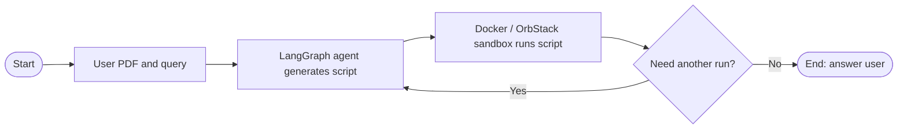

# PDF Sandbox Agent: Project Layout and Workflow

## Project layout

```text
pdf-sandbox-agent/
├── workspace/           # Shared folder mounted into the container
│   ├── document.pdf     # PDF supplied by the user
│   └── script.py        # Python script generated by the agent
├── Dockerfile           # Defines the isolated sandbox image
├── agent.py             # LangGraph agent running on your Mac
├── requirements.txt     # Python packages needed by the Mac host
└── .env                 # API key for the host agent; keep this private
```

## Workflow



**In simple terms:** LangGraph generates a script for the PDF, and OrbStack runs it. The result returns to LangGraph if another run is needed; otherwise, the agent answers the user and ends.

The `workspace/` folder lets the Mac host and the container access the same PDF and generated script. Keep the API key in the host's `.env`; the sandbox only needs the PDF, script, and any packages required to run the script.
